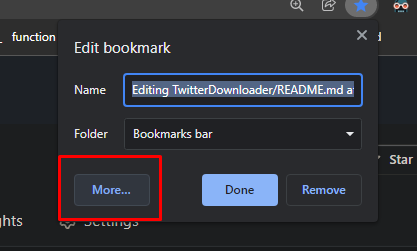
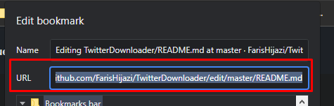

# [TwitterDownloader](https://github.com/FarisHijazi/TwitterDownloader)
Download images from twitter bookmarks and likes feed

Navigate to https://twitter.com/i/bookmarks or https://twitter.com/@USERNAME/likes

## Running the code

You have 2 options:

### Copy/paste

1. Use your mouse to select all the code in [TwitterDownlaoder.js](TwitterDownlaoder.js)
2. go to the twitter page, open the console (press `F12`, or `right click > inspect element`)
3. Paste

### Bookmarklet (works for mobile)

1. Use your mouse to select all the code in [TwitterDownlaoder.js](TwitterDownlaoder.js)
2. Bookmark any page in your browser, and replace the URL with the code
  - go to "more"  
  
  - and paste the code in the URL field  
  
4. Navigate to the twitter page and press the bookmark

This should run the code, and next you'll just have to click the bookmarklet instead of copy/paste everytime
